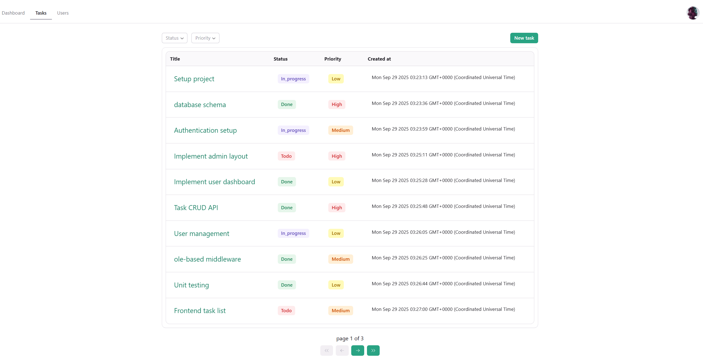

# App link: https://task-manager-gules-psi-84.vercel.app

# Task Manager

**Task Manager is a full-stack web application built to help companies manage projects in collaborative teams.**

## The app supports two main roles:

### Project Manager (Admin)

- View all tasks

- Create new tasks

- Edit tasks (description, status, priority, assignee)

- Assign tasks to developers

- Filter tasks by status and priority

- Sort tasks by table headers (title, status, priority, created date)

- View all users in the system

---

### Developer (User)

- View only their assigned tasks

- Open a task to see detailed information

- Update the task status

- Authentication

**Users can sign in using two options:**

- Credentials – register with email and password, then log in.

- Google Sign-In – log in directly with a Google account.

---

### Dashboard

- Available to both roles.

- Admins can click on any priority or status to instantly filter tasks across the project.

**The dashboard provides a project overview and quick insights for both roles:**

- Latest Tasks – see the most recently created tasks.

- Top 3 Developers – ranked by the number of completed tasks.

- Task Summary – breakdown of tasks by status and priority.

- Interactive Charts – statistics visualized with Recharts, making it easy to track project progress and workload distribution.

---

## Tech Stack

**This project is built with Next.js (full-stack), Prisma, and MongoDB.**
**It also uses the following libraries and tools:**

- **Authentication:** NextAuth.js with Prisma Adapter

- UI **Components:** Radix UI, TailwindCSS, Lucide React

- **Forms & Validation:** React Hook Form, Zod

- **Charts & Tables:** Recharts, Radix Themes

- **Other Utilities:** Axios, Bcrypt, React Hot Toast, React Markdown, SimpleMDE Editor, React Loading Skeleton

---

## Demo / Test Accounts

### The app Link: https://task-manager-gules-psi-84.vercel.app

### If you want to test the application:

**Admin Mode** – log in with this email and password:

- If you would like to test the **Admin mode**, please send me an email at **abedsandeed2@gmail.com** so I can grant you admin permissions.

**Developer Mode** – log in using the provided Google test account.
